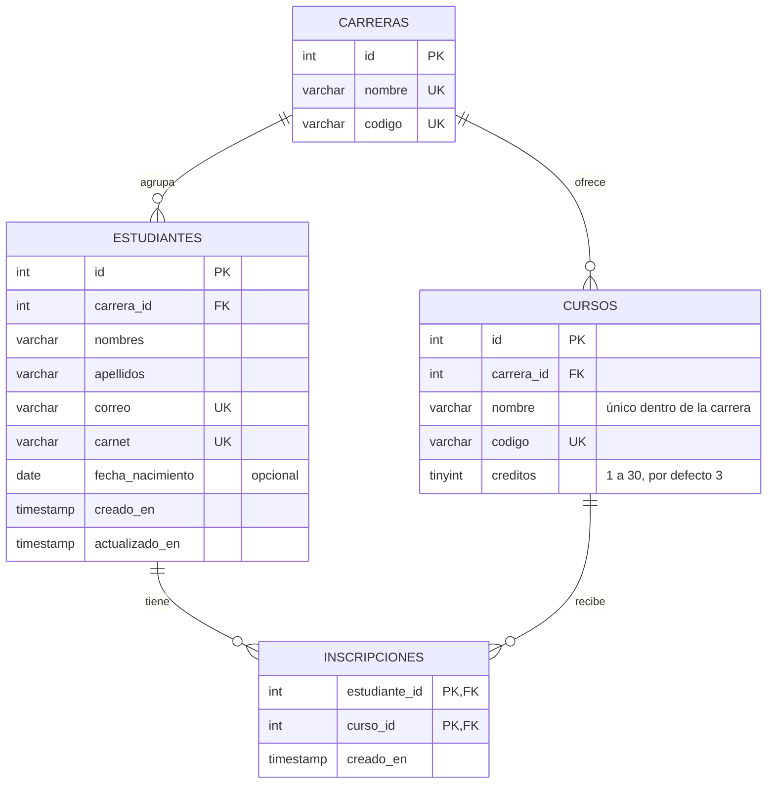

# Sistema Académico de Gestión de Estudiantes y Cursos

**Curso:** Desarrollo Web, Universidad Mariano Gálvez de Guatemala (UMG)  
**Integrantes:** [Nombre del integrante 1], [Nombre del integrante 2], [Nombre del integrante 3]

## Descripción

Aplicación web académica para consultar y administrar estudiantes y sus cursos. Separa interfaz, API y persistencia en MySQL.

## Problema que resuelve

Centraliza el registro de carreras, cursos y estudiantes con sus inscripciones, reduce duplicados y permite consultar los datos relacionados.

## Tecnologías

- Frontend: HTML5, CSS3 y JavaScript Vanilla, sin frameworks ni paso de compilación.
- Backend: Node.js y Express 4.
- Base de datos: MySQL 8 o MariaDB compatible.
- Conexión y configuración: `mysql2/promise`, `dotenv` y CORS.

## Arquitectura

**Usuario → Frontend → Fetch/HTTP → API REST → MySQL**

## Modelo de datos

Cada estudiante pertenece a **una** carrera y puede inscribirse en **varios** cursos de esa misma carrera. La relación muchos a muchos entre estudiantes y cursos se guarda en la tabla intermedia `inscripciones`.



| Llave foránea | Al borrar el registro padre |
|---|---|
| `cursos.carrera_id` → `carreras.id` | RESTRICT: no se puede borrar una carrera con cursos |
| `estudiantes.carrera_id` → `carreras.id` | RESTRICT: no se puede borrar una carrera con estudiantes |
| `inscripciones.estudiante_id` → `estudiantes.id` | CASCADE: al borrar un estudiante se borran sus inscripciones |
| `inscripciones.curso_id` → `cursos.id` | RESTRICT: no se puede borrar un curso con inscritos |

La regla "los cursos deben ser de la carrera del estudiante" la valida la API (`backend/validators/estudiantes.js`), no una restricción de MySQL.

Datos iniciales con IDs fijos: carreras 1 (Sistemas), 2 (Administración) y 3 (Psicología); cursos 1-4, 5-8 y 9-12 respectivamente; 6 estudiantes con 2 o 3 cursos cada uno.

## Estructura de carpetas

```text
database/
  database.sql
backend/
  controllers/
  routes/
  validators/
  .env.example
  db.js
  package.json
  server.js
frontend/
  index.html          vistas "Estudiantes" y "Carreras y cursos"
  styles.css
  js/
    main.js           punto de entrada: navegación entre vistas e inicio
    api.js            fetch() y conversión de errores (API_URL, solicitar, ErrorApi)
    ui.js             mensajes, estados de carga, errores de campos y utilidades de DOM
    estudiantes.js    tabla y formulario de estudiantes con carrera y cursos
    carreras.js       carreras y cursos: crear, eliminar, listar y filtrar
    inscripciones.js  panel de detalle del estudiante: inscribir y quitar cursos
docs/
  postman_collection.json
README.md
.gitignore
```

## Instalación y ejecución en Windows / PowerShell

Requisitos: Node.js 20 o posterior y MySQL 8 o MariaDB instalado y en ejecución.

1. Instale dependencias desde la raíz del proyecto:

   ```powershell
   Set-Location .\backend
   npm install
   ```

2. Cree el archivo local de variables y edite las credenciales:

   ```powershell
   Copy-Item .env.example .env
   notepad .env
   ```

   Configure `DB_HOST`, `DB_PORT`, `DB_USER`, `DB_PASSWORD` y `DB_NAME`. `CORS_ORIGIN` admite orígenes separados por coma.

3. Ejecute el SQL desde la raíz:

   ```powershell
   Set-Location ..
   mysql -u root -p --default-character-set=utf8mb4 -e "source database/database.sql"
   ```

   Ingrese la contraseña cuando MySQL la solicite. Reemplace `root` si usa otro usuario. La opción `--default-character-set=utf8mb4` evita que los acentos se guarden corruptos.

   > **Advertencia:** `database.sql` borra las tablas `inscripciones`, `estudiantes`, `cursos` y `carreras` con todos sus datos y las vuelve a crear con los datos iniciales. Úselo solo para instalar o reiniciar la base.

4. Inicie el backend:

   ```powershell
   Set-Location .\backend
   npm run dev
   ```

   La API escucha en `http://localhost:3000`. Si MySQL o las credenciales no funcionan, el backend muestra un mensaje y termina con error.

5. Detenga el servidor con `Ctrl+C`. Puede importar `docs/postman_collection.json` en Postman.

## Abrir el frontend

El frontend debe servirse por HTTP en el puerto 5500, por dos razones: la API solo acepta (CORS) los orígenes `http://localhost:5500` y `http://127.0.0.1:5500`, y los navegadores no cargan módulos ES (`<script type="module">`) desde `file://`. No funciona abriendo `index.html` con doble clic.

1. Con el backend en ejecución, abra otra terminal en la raíz del proyecto y ejecute:

   ```powershell
   npx serve frontend -l 5500
   ```

   `npx` descarga y ejecuta `serve` temporalmente; no se agrega ninguna dependencia al proyecto. La primera vez puede pedir confirmación para instalarlo.

2. Abra `http://localhost:5500` en el navegador.
3. Detenga el servidor estático con `Ctrl+C`.

La dirección de la API se configura en la constante `API_URL` de `frontend/js/api.js`.

La interfaz tiene dos vistas que se cambian desde el menú sin recargar la página (`#estudiantes` y `#carreras-cursos`):

- **Estudiantes:** se registra al estudiante con sus datos y su carrera; los cursos son opcionales al registrar. El botón **Ver / Cursos** de cada fila abre un panel con los datos en modo lectura, la lista de cursos inscritos (con **Quitar**) y un select **Agregar curso** con los cursos de su carrera en los que aún no está inscrito. **Editar datos** usa el mismo formulario, sin la sección de cursos.
- **Carreras y cursos:** crear y eliminar carreras y cursos, y filtrar los cursos por carrera. Los cambios se reflejan de inmediato en la vista Estudiantes.

## Endpoints

| Método | Ruta | Descripción | Códigos principales |
|---|---|---|---|
| GET | `/api/health` | Verifica API y conexión con MySQL | 200, 500 |
| GET | `/api/carreras` | Lista carreras con `total_cursos`, ordenadas por nombre | 200, 500 |
| POST | `/api/carreras` | Crea carrera `{ nombre, codigo }` | 201, 400, 409, 500 |
| DELETE | `/api/carreras/:id` | Elimina carrera sin cursos ni estudiantes | 200, 400, 404, 409, 500 |
| GET | `/api/cursos` | Lista cursos; filtro opcional `?carrera_id=N` | 200, 400, 500 |
| POST | `/api/cursos` | Crea curso `{ carrera_id, nombre, codigo, creditos? }` | 201, 400, 409, 500 |
| DELETE | `/api/cursos/:id` | Elimina curso sin inscritos | 200, 400, 404, 409, 500 |
| GET | `/api/estudiantes` | Lista estudiantes con carrera y cursos | 200, 500 |
| GET | `/api/estudiantes/:id` | Obtiene estudiante con carrera y cursos | 200, 400, 404, 500 |
| POST | `/api/estudiantes` | Registra estudiante e inscripciones (transacción) | 201, 400, 409, 500 |
| PUT | `/api/estudiantes/:id` | Actualiza estudiante y reemplaza inscripciones (transacción) | 200, 400, 404, 409, 500 |
| DELETE | `/api/estudiantes/:id` | Elimina estudiante; sus inscripciones se borran en cascada | 200, 400, 404, 500 |
| GET | `/api/estudiantes/:id/cursos` | Cursos inscritos del estudiante, ordenados por nombre | 200, 400, 404, 500 |
| POST | `/api/estudiantes/:id/cursos` | Inscribe un curso `{ "cursoId": n }` (también acepta `curso_id`); devuelve el curso | 201, 400, 404, 409, 500 |
| DELETE | `/api/estudiantes/:id/cursos/:cursoId` | Quita la inscripción (sin cuerpo en la respuesta) | 204, 400, 404, 500 |

Cuerpo de POST y PUT de estudiantes:

```json
{
  "nombres": "María Fernanda",
  "apellidos": "Gómez López",
  "correo": "maria.gomez@example.com",
  "carnet": "2026-IS-099",
  "fecha_nacimiento": "2004-05-20",
  "carrera_id": 1,
  "cursos": [1, 2]
}
```

`fecha_nacimiento` y `cursos` son opcionales. Si se envía `cursos`, debe ser un arreglo (puede estar vacío) sin repetidos, y todos deben pertenecer a `carrera_id`. Las respuestas de estudiantes incluyen `carrera_id`, `carrera_nombre` y `cursos: [{ id, nombre, codigo, creditos }]` ordenados por nombre.

**Inscripciones en POST y PUT:**

- **POST:** si trae `cursos`, inscribe esos cursos; si no, el estudiante queda sin inscripciones.
- **PUT con `cursos`** (aunque sea `[]`): reemplaza todas las inscripciones.
- **PUT sin `cursos`:** no toca las inscripciones. Así se editan los datos personales sin reenviar los cursos.
- **Cambio de carrera:** si el PUT cambia `carrera_id`, no trae `cursos` y el estudiante tiene inscripciones, la API responde **409** y no cambia nada. Para cambiar de carrera hay que enviar `cursos` con cursos de la nueva carrera, o `[]` para quitar todas las inscripciones en la misma transacción. El frontend pide confirmación y envía `cursos: []`.

**Validaciones de `POST /api/estudiantes/:id/cursos`:**

| Código | Caso |
|---|---|
| 404 | El estudiante o el curso no existen |
| 400 | El curso no pertenece a la carrera del estudiante, o `cursoId` es inválido |
| 409 | El estudiante ya está inscrito en ese curso |

`DELETE /api/estudiantes/:id/cursos/:cursoId` responde 404 si el estudiante no existe o si no está inscrito en ese curso.

Los errores responden `{ "error": "mensaje en español" }`; la validación (400) incluye además `detalles` con mensajes legibles.

## Seguridad básica

- Las consultas parametrizan los valores recibidos; no se concatenan datos externos al SQL.
- Las credenciales se leen de `backend/.env` y no están escritas en el código.
- `.gitignore` excluye `node_modules/` y `.env`; el archivo de ejemplo usa valores ficticios.
- El backend limita el tamaño del JSON y no expone detalles internos en las respuestas de error.

## Pruebas de la API

Con MySQL y el backend en ejecución, desde la raíz del proyecto:

```powershell
.\docs\probar-api.ps1
```

- `docs/probar-api.ps1` prueba carreras, cursos, estudiantes e inscripciones (creación, filtros, reemplazo de cursos, borrado en cascada y errores 400, 404 y 409), además de verificar el contenido de algunas respuestas. Muestra una tabla resumen con el código esperado y el obtenido, y termina con código de salida 1 si algo falla. Los registros que crea llevan la marca de tiempo y se eliminan al final.
- `docs/probar-500.ps1` es una prueba guiada del código 500: pide detener `MySQL80` en otra ventana como administrador, verifica que `/api/health`, `/api/estudiantes` y `/api/cursos` respondan 500 con un mensaje genérico y, tras reiniciar el servicio, comprueba si el pool se recupera sin reiniciar el backend. El script no detiene MySQL por sí mismo.
- Ambos scripts guardan su salida en `docs/evidencias/` (`pruebas-api-AAAAMMDD-HHmm.txt` y `prueba-500-AAAAMMDD-HHmm.txt`).

La guía de estudio para la defensa técnica está en `docs/guia-defensa.md`.
